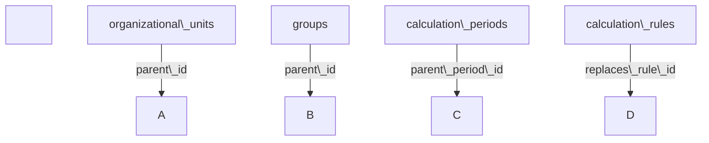
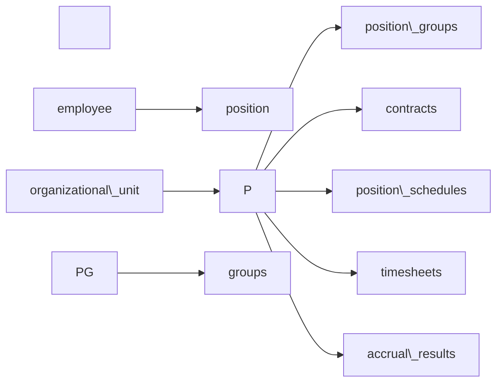
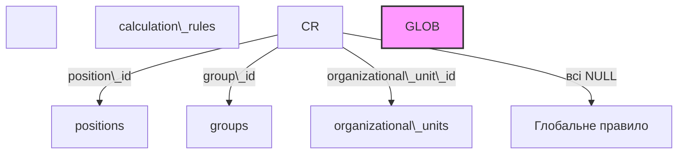
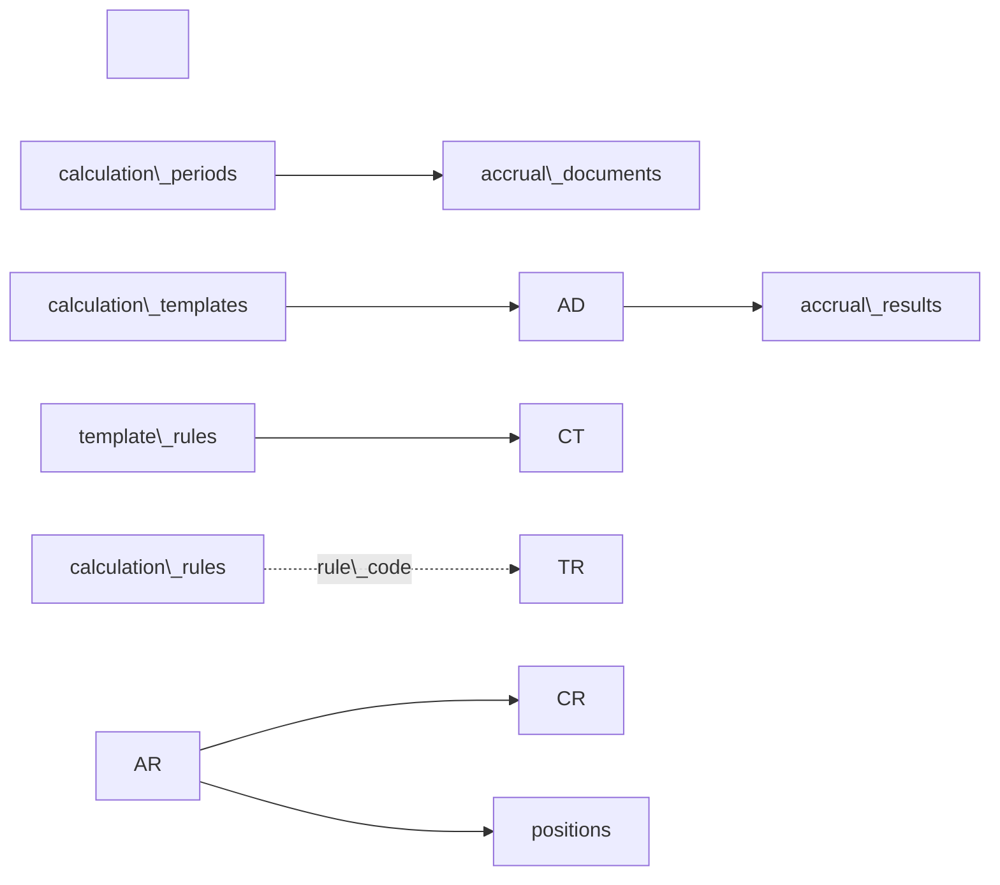
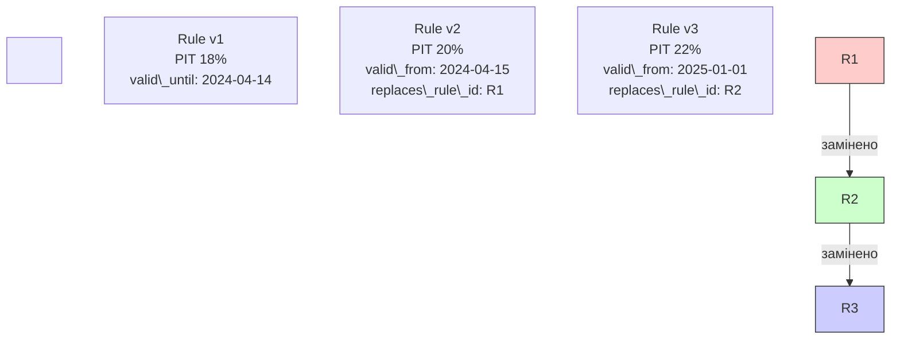
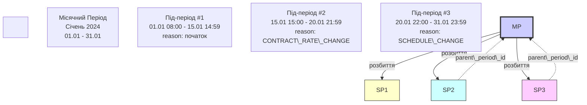
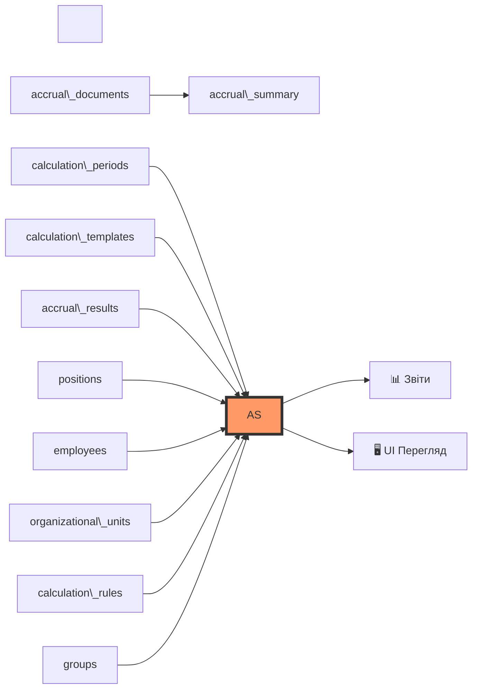
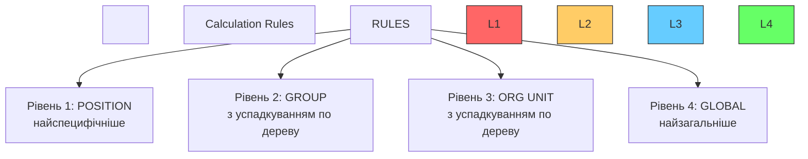
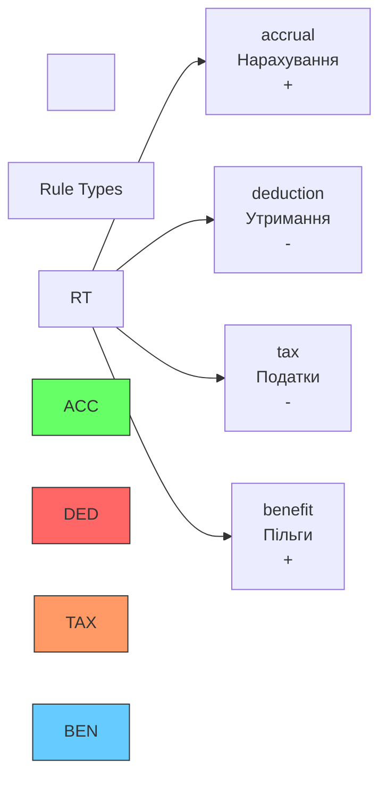

\# ER Діаграма Системи Розрахунку Зарплат


\## Повна Діаграма

```mermaid

erDiagram

&nbsp;   %% ========================================

&nbsp;   %% ДЕРЕВО ПІДПРИЄМСТВА

&nbsp;   %% ========================================

&nbsp;   organizational\_units ||--o{ organizational\_units : "parent\_id"

&nbsp;   organizational\_units ||--o{ positions : "працює в"

&nbsp;   organizational\_units ||--o{ calculation\_rules : "має правила"

&nbsp;   organizational\_units ||--o{ calculation\_periods : "розрахунок для"

&nbsp;   organizational\_units ||--o{ accrual\_documents : "документи для"

&nbsp;   

&nbsp;   organizational\_units {

&nbsp;       int id PK

&nbsp;       int parent\_id FK "NULL для кореня"

&nbsp;       string code UK "унікальний код"

&nbsp;       string name

&nbsp;       int level "рівень в дереві"

&nbsp;       string full\_path

&nbsp;       string unit\_type

&nbsp;       boolean is\_active

&nbsp;   }

&nbsp;   

&nbsp;   %% ========================================

&nbsp;   %% ДЕРЕВО ГРУП

&nbsp;   %% ========================================

&nbsp;   groups ||--o{ groups : "parent\_id"

&nbsp;   groups ||--o{ position\_groups : "містить позиції"

&nbsp;   groups ||--o{ calculation\_rules : "має правила"

&nbsp;   

&nbsp;   groups {

&nbsp;       int id PK

&nbsp;       int parent\_id FK "NULL для кореня"

&nbsp;       string code UK "унікальний код"

&nbsp;       string name

&nbsp;       int level "рівень в дереві"

&nbsp;       string full\_path

&nbsp;       string group\_type "social/professional"

&nbsp;       boolean is\_active

&nbsp;   }

&nbsp;   

&nbsp;   %% ========================================

&nbsp;   %% ПРАЦІВНИКИ ТА ПОЗИЦІЇ

&nbsp;   %% ========================================

&nbsp;   employees ||--o{ positions : "має позиції"

&nbsp;   employees ||--o{ calculation\_periods : "розрахунок для"

&nbsp;   employees ||--o{ accrual\_results : "має нарахування"

&nbsp;   

&nbsp;   employees {

&nbsp;       int id PK

&nbsp;       string personnel\_number UK "табельний"

&nbsp;       string tax\_number

&nbsp;       string first\_name

&nbsp;       string last\_name

&nbsp;       date hire\_date

&nbsp;       date termination\_date

&nbsp;       string status "active/terminated"

&nbsp;       boolean is\_active

&nbsp;   }

&nbsp;   

&nbsp;   positions ||--o{ position\_groups : "належить до груп"

&nbsp;   positions ||--o{ contracts : "має контракти"

&nbsp;   positions ||--o{ position\_schedules : "має графіки"

&nbsp;   positions ||--o{ timesheets : "має табель"

&nbsp;   positions ||--o{ calculation\_rules : "персональні правила"

&nbsp;   positions ||--o{ accrual\_results : "нарахування"

&nbsp;   

&nbsp;   positions {

&nbsp;       int id PK

&nbsp;       int employee\_id FK

&nbsp;       int organizational\_unit\_id FK

&nbsp;       string position\_code UK

&nbsp;       string position\_name

&nbsp;       decimal employment\_rate "0.5=50%, 1.0=100%"

&nbsp;       date start\_date

&nbsp;       date end\_date

&nbsp;       boolean is\_active

&nbsp;   }

&nbsp;   

&nbsp;   %% ========================================

&nbsp;   %%MANY-TO-MANY: Позиції ↔ Групи

&nbsp;   %% ========================================

&nbsp;   position\_groups }o--|| positions : "позиція"

&nbsp;   position\_groups }o--|| groups : "група"

&nbsp;   

&nbsp;   position\_groups {

&nbsp;       int id PK

&nbsp;       int position\_id FK

&nbsp;       int group\_id FK

&nbsp;       timestamp valid\_from "початок належності"

&nbsp;       timestamp valid\_until "кінець належності"

&nbsp;       jsonb metadata "діти, інвалідність, тощо"

&nbsp;       string document\_number

&nbsp;       boolean is\_active

&nbsp;   }

&nbsp;   

&nbsp;   %% ========================================

&nbsp;   %% КОНТРАКТИ

&nbsp;   %% ========================================

&nbsp;   contracts }o--|| positions : "для позиції"

&nbsp;   

&nbsp;   contracts {

&nbsp;       int id PK

&nbsp;       int position\_id FK

&nbsp;       string contract\_type "salary/hourly/piecework"

&nbsp;       decimal base\_rate "оклад/ставка"

&nbsp;       timestamp start\_datetime "TIMESTAMP!"

&nbsp;       timestamp end\_datetime

&nbsp;       boolean is\_active

&nbsp;   }

&nbsp;   

&nbsp;   %% ========================================

&nbsp;   %% ГРАФІКИ ЗМІН

&nbsp;   %% ========================================

&nbsp;   shift\_schedules ||--o{ position\_schedules : "використовується в"

&nbsp;   position\_schedules }o--|| positions : "для позиції"

&nbsp;   

&nbsp;   shift\_schedules {

&nbsp;       int id PK

&nbsp;       string code UK

&nbsp;       string name

&nbsp;       string schedule\_type "fixed/rotating"

&nbsp;       time shift\_start "08:00"

&nbsp;       time shift\_end "17:00"

&nbsp;       int break\_minutes

&nbsp;       int\[] days\_of\_week "1-7"

&nbsp;       decimal rate\_multiplier "1.0/1.5/2.0"

&nbsp;       boolean is\_active

&nbsp;   }

&nbsp;   

&nbsp;   position\_schedules {

&nbsp;       int id PK

&nbsp;       int position\_id FK

&nbsp;       int schedule\_id FK

&nbsp;       timestamp valid\_from

&nbsp;       timestamp valid\_until

&nbsp;       boolean is\_active

&nbsp;   }

&nbsp;   

&nbsp;   %% ========================================

&nbsp;   %% ТАБЕЛЬ

&nbsp;   %% ========================================

&nbsp;   timesheets }o--|| positions : "для позиції"

&nbsp;   

&nbsp;   timesheets {

&nbsp;       int id PK

&nbsp;       int position\_id FK

&nbsp;       timestamp work\_start "TIMESTAMP!"

&nbsp;       timestamp work\_end "TIMESTAMP!"

&nbsp;       int duration\_minutes "авто"

&nbsp;       int break\_minutes

&nbsp;       int overtime\_minutes

&nbsp;       string shift\_type "day/night"

&nbsp;       string status "draft/confirmed"

&nbsp;   }

&nbsp;   

&nbsp;   %% ========================================

&nbsp;   %% ПРАВИЛА (З IMMUTABILITY)

&nbsp;   %% ========================================

&nbsp;   calculation\_rules }o--o| positions : "для позиції"

&nbsp;   calculation\_rules }o--o| organizational\_units : "для підрозділу"

&nbsp;   calculation\_rules }o--o| groups : "для групи"

&nbsp;   calculation\_rules }o--o| calculation\_rules : "replaces\_rule\_id"

&nbsp;   

&nbsp;   calculation\_rules {

&nbsp;       int id PK

&nbsp;       int position\_id FK "NULL"

&nbsp;       int organizational\_unit\_id FK "NULL"

&nbsp;       int group\_id FK "NULL"

&nbsp;       string code "BASE\_SALARY (НЕ унікальний!)"

&nbsp;       string name

&nbsp;       text sql\_code "SQL для розрахунку"

&nbsp;       string rule\_type "accrual/deduction"

&nbsp;       timestamp valid\_from "IMMUTABILITY!"

&nbsp;       timestamp valid\_until "NULL=безстроково"

&nbsp;       int version "1,2,3..."

&nbsp;       int replaces\_rule\_id FK "версійність"

&nbsp;       string combination\_mode "CUMULATIVE/OVERRIDE"

&nbsp;       int priority

&nbsp;       time time\_of\_day\_start "22:00 для нічних"

&nbsp;       time time\_of\_day\_end "06:00"

&nbsp;       int\[] days\_of\_week

&nbsp;       jsonb exclusion\_groups

&nbsp;       boolean is\_active

&nbsp;   }

&nbsp;   

&nbsp;   %% ========================================

&nbsp;   %% ШАБЛОНИ

&nbsp;   %% ========================================

&nbsp;   calculation\_templates ||--o{ template\_rules : "містить правила"

&nbsp;   template\_rules }o..|| calculation\_rules : "посилається на code"

&nbsp;   

&nbsp;   calculation\_templates {

&nbsp;       int id PK

&nbsp;       string code UK

&nbsp;       string name

&nbsp;       string template\_type

&nbsp;       boolean is\_active

&nbsp;   }

&nbsp;   

&nbsp;   template\_rules {

&nbsp;       int id PK

&nbsp;       int template\_id FK

&nbsp;       string rule\_code "НЕ FK!"

&nbsp;       int execution\_order "1,2,3..."

&nbsp;       text condition\_sql

&nbsp;       boolean is\_active

&nbsp;   }

&nbsp;   

&nbsp;   %% ========================================

&nbsp;   %% ПЕРІОДИ (З РОЗБИТТЯМ)

&nbsp;   %% ========================================

&nbsp;   calculation\_periods ||--o{ calculation\_periods : "parent\_period\_id"

&nbsp;   calculation\_periods ||--o{ accrual\_documents : "має документи"

&nbsp;   calculation\_periods }o--o| organizational\_units : "для підрозділу"

&nbsp;   calculation\_periods }o--o| employees : "для працівника"

&nbsp;   

&nbsp;   calculation\_periods {

&nbsp;       int id PK

&nbsp;       string period\_code "2024-01-1"

&nbsp;       string period\_name

&nbsp;       timestamp start\_datetime "TIMESTAMP!"

&nbsp;       timestamp end\_datetime "TIMESTAMP!"

&nbsp;       string period\_type "monthly/split"

&nbsp;       int organizational\_unit\_id FK

&nbsp;       int employee\_id FK

&nbsp;       string split\_reason "rate\_change/rule\_change"

&nbsp;       int parent\_period\_id FK "якщо під-період"

&nbsp;       jsonb conditions\_snapshot "snapshot умов"

&nbsp;       string status "draft/completed"

&nbsp;   }

&nbsp;   

&nbsp;   %% ========================================

&nbsp;   %% ДОКУМЕНТИ ТА РЕЗУЛЬТАТИ

&nbsp;   %% ========================================

&nbsp;   accrual\_documents ||--o{ accrual\_results : "містить результати"

&nbsp;   accrual\_documents }o--|| calculation\_periods : "за період"

&nbsp;   accrual\_documents }o--|| calculation\_templates : "за шаблоном"

&nbsp;   accrual\_documents }o--o| organizational\_units : "для підрозділу"

&nbsp;   

&nbsp;   accrual\_documents {

&nbsp;       int id PK

&nbsp;       string document\_number UK

&nbsp;       date document\_date

&nbsp;       int period\_id FK

&nbsp;       int template\_id FK

&nbsp;       int organizational\_unit\_id FK

&nbsp;       string status "draft/approved"

&nbsp;       timestamp calculated\_at

&nbsp;       string calculated\_by

&nbsp;       timestamp approved\_at

&nbsp;       string approved\_by

&nbsp;   }

&nbsp;   

&nbsp;   accrual\_results }o--|| accrual\_documents : "в документі"

&nbsp;   accrual\_results }o--|| positions : "для позиції"

&nbsp;   accrual\_results }o--|| employees : "для працівника (денорм)"

&nbsp;   accrual\_results }o--|| organizational\_units : "для підрозділу (денорм)"

&nbsp;   accrual\_results }o--|| calculation\_rules : "по правилу"

&nbsp;   

&nbsp;   accrual\_results {

&nbsp;       int id PK

&nbsp;       int document\_id FK

&nbsp;       int position\_id FK

&nbsp;       int employee\_id FK "денормалізація"

&nbsp;       int organizational\_unit\_id FK "денормалізація"

&nbsp;       int rule\_id FK

&nbsp;       string rule\_code "копія"

&nbsp;       string rule\_source\_type "position/group/org/global"

&nbsp;       int rule\_source\_id "ID джерела"

&nbsp;       decimal amount "сума"

&nbsp;       decimal calculation\_base "база"

&nbsp;       string status "active/cancelled"

&nbsp;   }

&nbsp;   

&nbsp;   %% ========================================

&nbsp;   %% ДОВІДНИКИ

&nbsp;   %% ========================================

&nbsp;   split\_reasons {

&nbsp;       string code PK

&nbsp;       string name

&nbsp;       string description

&nbsp;       boolean auto\_split

&nbsp;   }

```


---


\## Ключові Зв'язки


\### 1. Дві Ієрархії (Самопосилання)




\### 2. Позиція - Центр Системи




\### 3. Правила - 4 Рівні Прив'язки




\### 4. Workflow Розрахунку




---


\## Immutability (Незмінність)


\### Правила НЕ Редагуються




\### Історія Контрактів

```mermaid

timeline

&nbsp;   title Контракти для Position #123

&nbsp;   2024-01-01 : Contract #1 : 10000 грн/міс : salary

&nbsp;   2024-04-15 15:00 : Contract #2 : 12000 грн/міс : salary

&nbsp;   2024-08-01 : Contract #3 : 180 грн/год : hourly

```


---


\## Розбиття Періодів


\### Автоматичне при Змінах




---


\## Materialized View: accrual\_summary


\### Швидкий Перегляд Нарахувань




---


\## Типи Правил


\### За Scope (Область Дії)




\### За Типом




---


\## Статистика Таблиць


| Категорія | Таблиць | Опис |

|-----------|---------|------|

| \*\*Структура\*\* | 2 | organizational\_units, groups (обидві ієрархічні) |

| \*\*Працівники\*\* | 2 | employees, positions |

| \*\*Зв'язки\*\* | 3 | position\_groups, contracts, position\_schedules |

| \*\*Час\*\* | 2 | timesheets, shift\_schedules |

| \*\*Правила\*\* | 3 | calculation\_rules, calculation\_templates, template\_rules |

| \*\*Розрахунки\*\* | 3 | calculation\_periods, accrual\_documents, accrual\_results |

| \*\*Довідники\*\* | 1 | split\_reasons |

| \*\*Views\*\* | 1 | accrual\_summary (materialized) |

| \*\*РАЗОМ\*\* | \*\*17\*\* | базових таблиць + 1 view |


---


\## Індекси (Основні)


\### Для Швидкого Пошуку

```sql

-- Ієрархії

idx\_org\_units\_parent, idx\_groups\_parent

idx\_periods\_parent, idx\_rules\_replaces


-- Часові діапазони

idx\_rules\_dates (valid\_from, valid\_until)

idx\_periods\_datetime (start\_datetime, end\_datetime)

idx\_timesheets\_time (work\_start, work\_end)


-- Зв'язки

idx\_positions\_employee, idx\_positions\_org\_unit

idx\_position\_groups\_position, idx\_position\_groups\_group

idx\_accrual\_results\_document, idx\_accrual\_results\_position


-- Пошук

idx\_employees\_personnel\_number

idx\_rules\_code\_dates

idx\_accrual\_summary\_period

```


---


\##Constrains (Обмеження)


\### Check Constraints

```sql

-- Самопосилання

CHECK (id != parent\_id)


-- Дати

CHECK (end\_date >= start\_date)

CHECK (valid\_until > valid\_from)

CHECK (work\_end > work\_start)


-- Значення

CHECK (employment\_rate > 0 AND employment\_rate <= 2.0)

CHECK (base\_rate >= 0)

CHECK (break\_minutes >= 0)


-- Scope правила (тільки одне NOT NULL)

CHECK (

&nbsp;   (position\_id IS NOT NULL AND org IS NULL AND group IS NULL) OR

&nbsp;   (position\_id IS NULL AND org IS NOT NULL AND group IS NULL) OR

&nbsp;   (position\_id IS NULL AND org IS NULL AND group IS NOT NULL) OR

&nbsp;   (position\_id IS NULL AND org IS NULL AND group IS NULL)

)

```


\### Foreign Keys


\- \*\*CASCADE\*\* - для залежних даних (position → contract, document → results)

\- \*\*SET NULL\*\* - для ієрархій (parent\_id) та історії (replaces\_rule\_id)

\- \*\*RESTRICT\*\* (default) - для основних зв'язків


---


\## Тригери


\### Автоматичні Обчислення

```sql

-- Тривалість табелю

CREATE TRIGGER trg\_calculate\_duration

&nbsp;   BEFORE INSERT OR UPDATE ON timesheets

&nbsp;   FOR EACH ROW

&nbsp;   EXECUTE FUNCTION calculate\_timesheet\_duration();


-- Оновлює duration\_minutes = (work\_end - work\_start) / 60

```


---


\## Кінець Діаграми


\*\*Дата створення:\*\* 2025-01-30  

\*\*Версія:\*\* 2.0  

\*\*Автор:\*\* Система розрахунку зарплат

